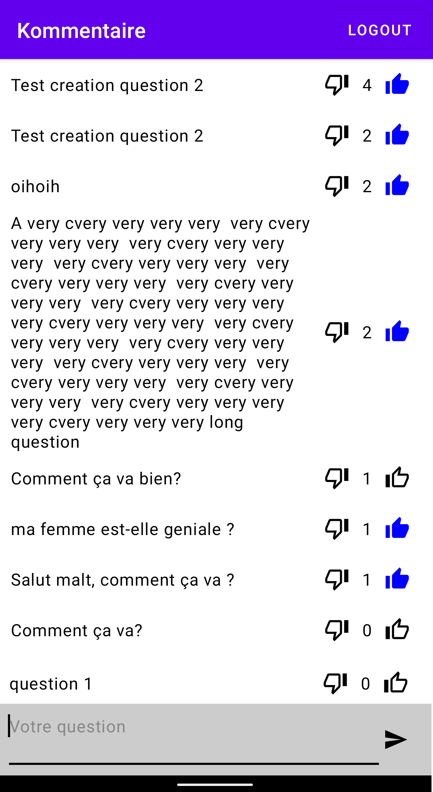

# kommentaire-app

Kommentaire is a Kotlin Multiplatform app to collect questions during meetups. It is written 100% in Kotlin using:

* [Apollo Android](https://github.com/apollographql/apollo-android) 
* [Jetpack Compose](https://developer.android.com/jetpack/compose) on Android
* [SwiftUI](https://developer.apple.com/xcode/swiftui/) on iOS

The Kommentaire app uses the [Kommentaire backend](https://github.com/aaudelin/kommentaire-server), which is also written 100% in Kotlin.

Issues/PRs and question welcome!
